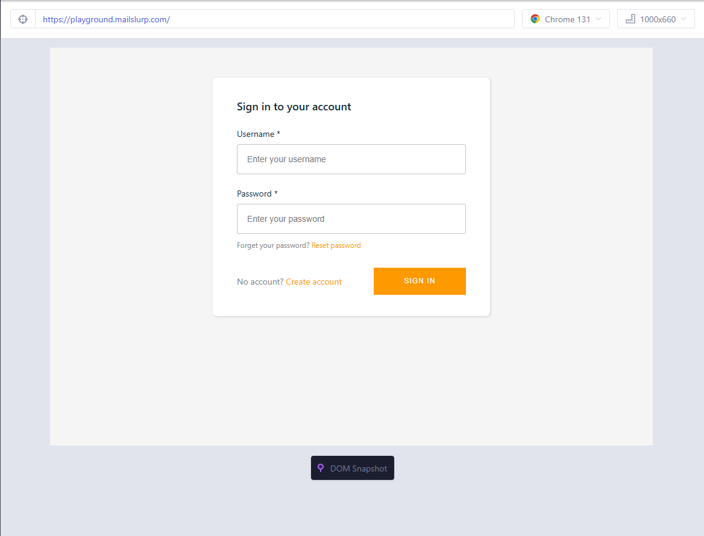
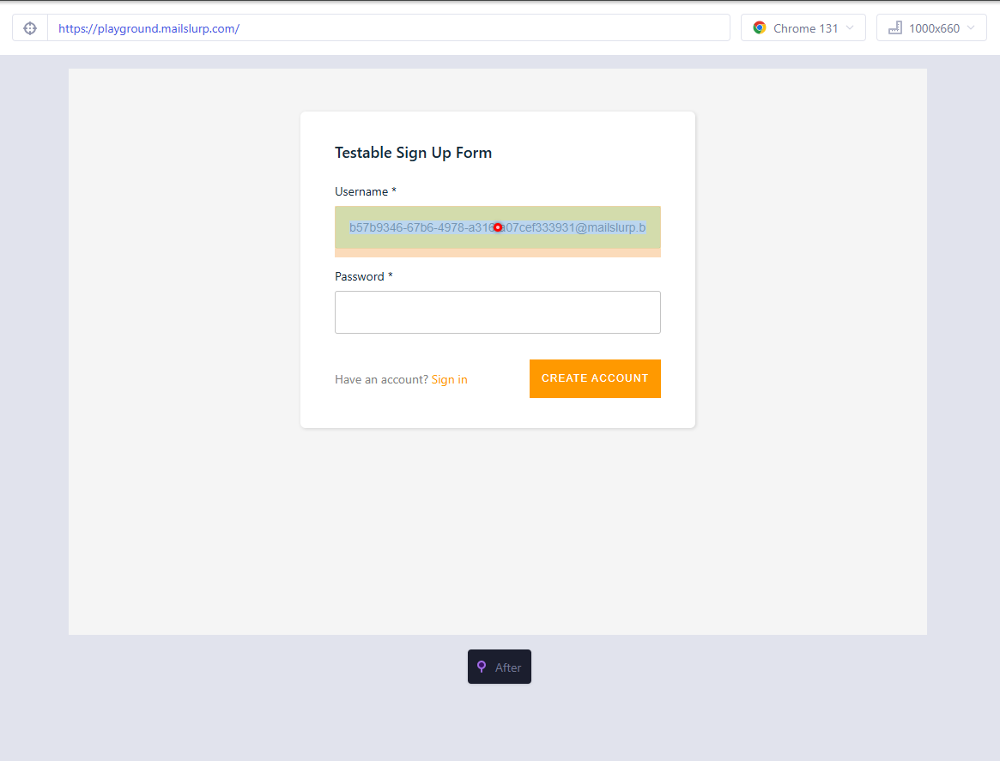
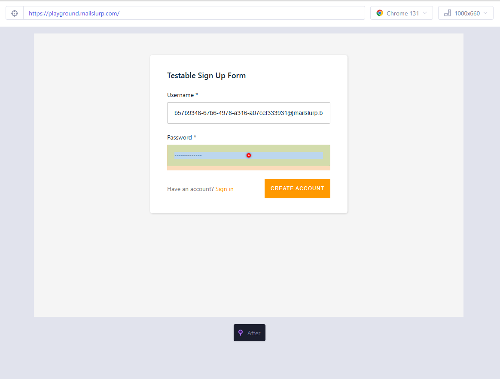
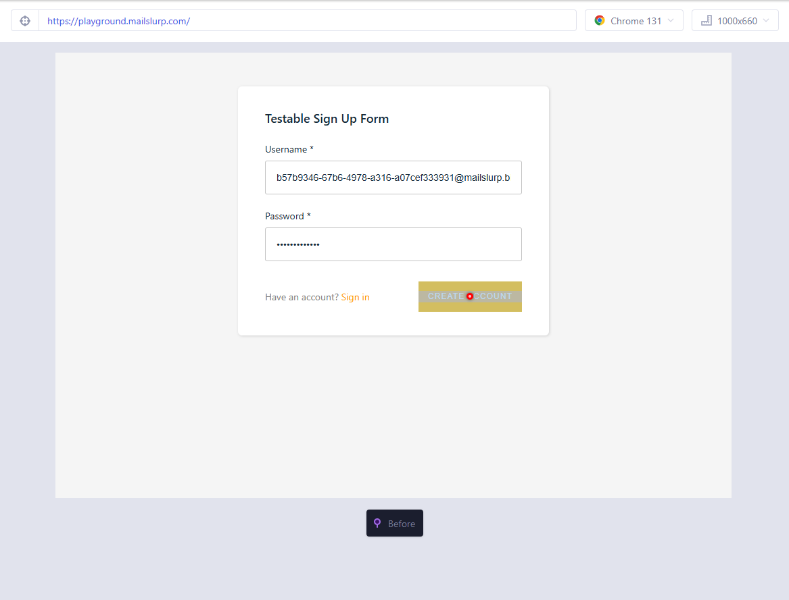
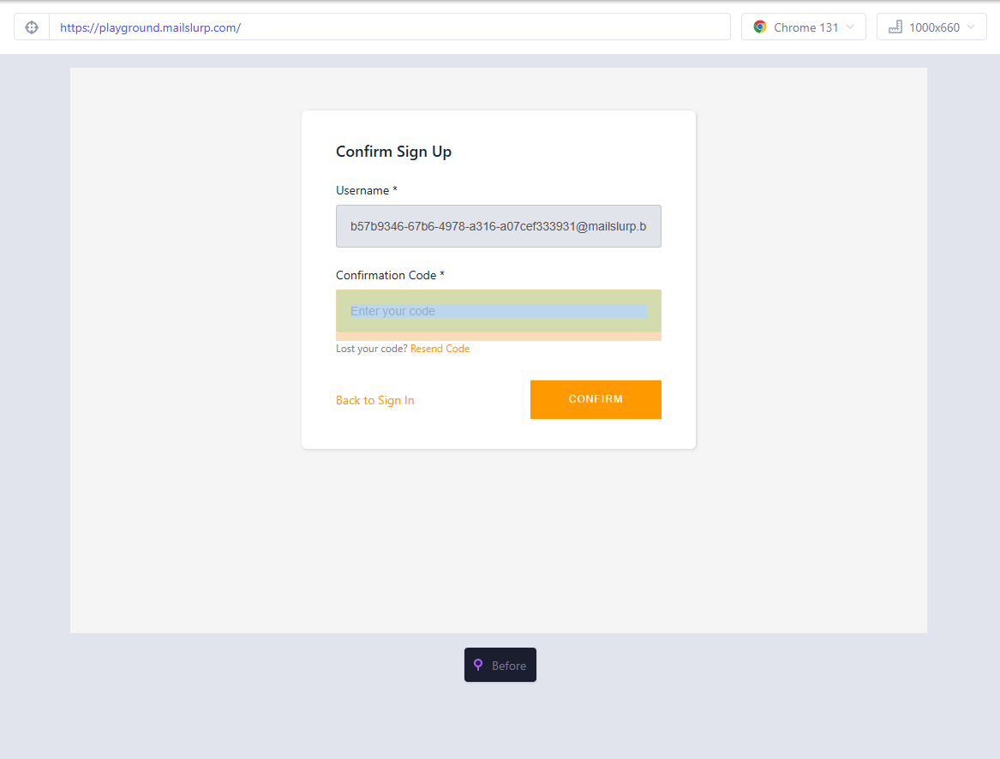
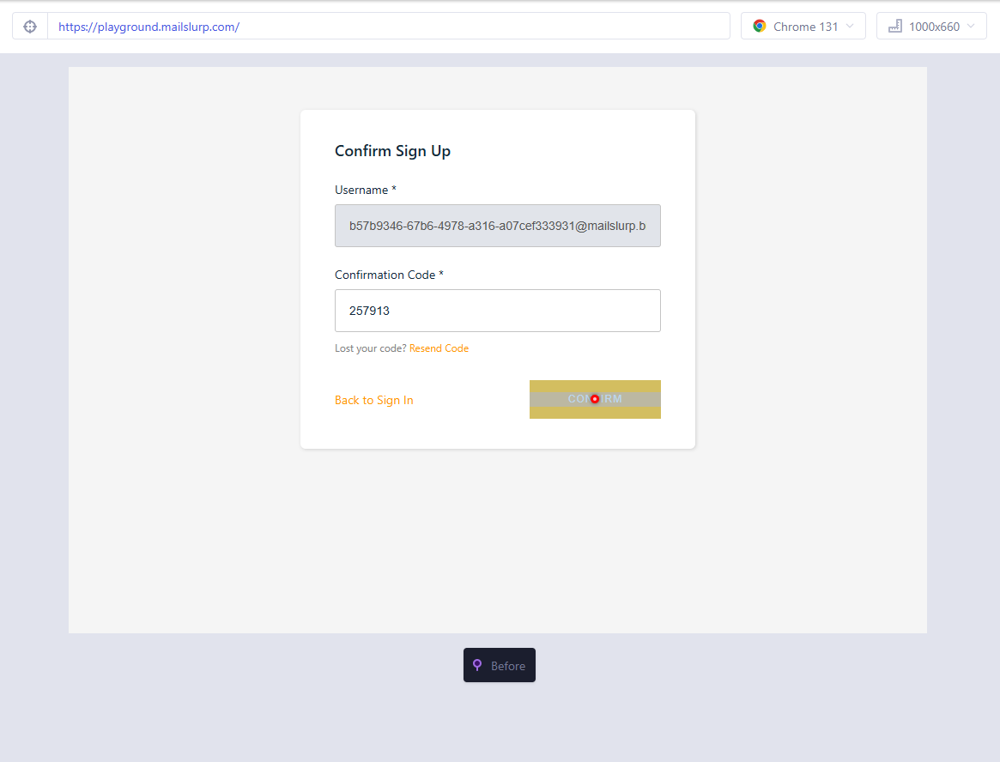
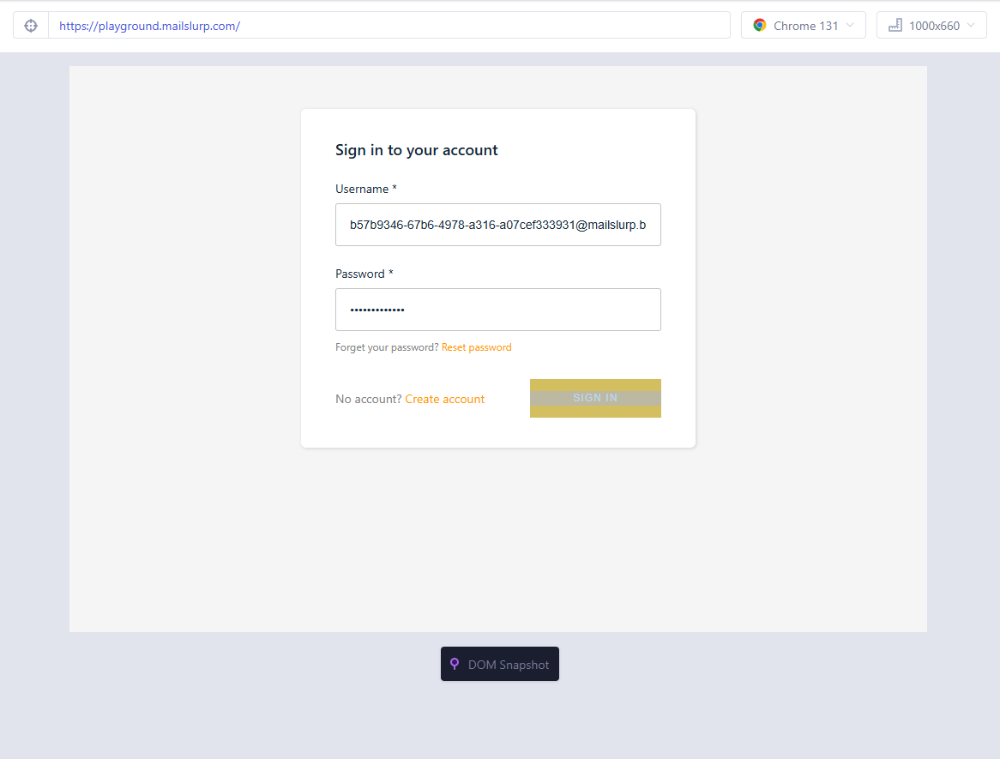
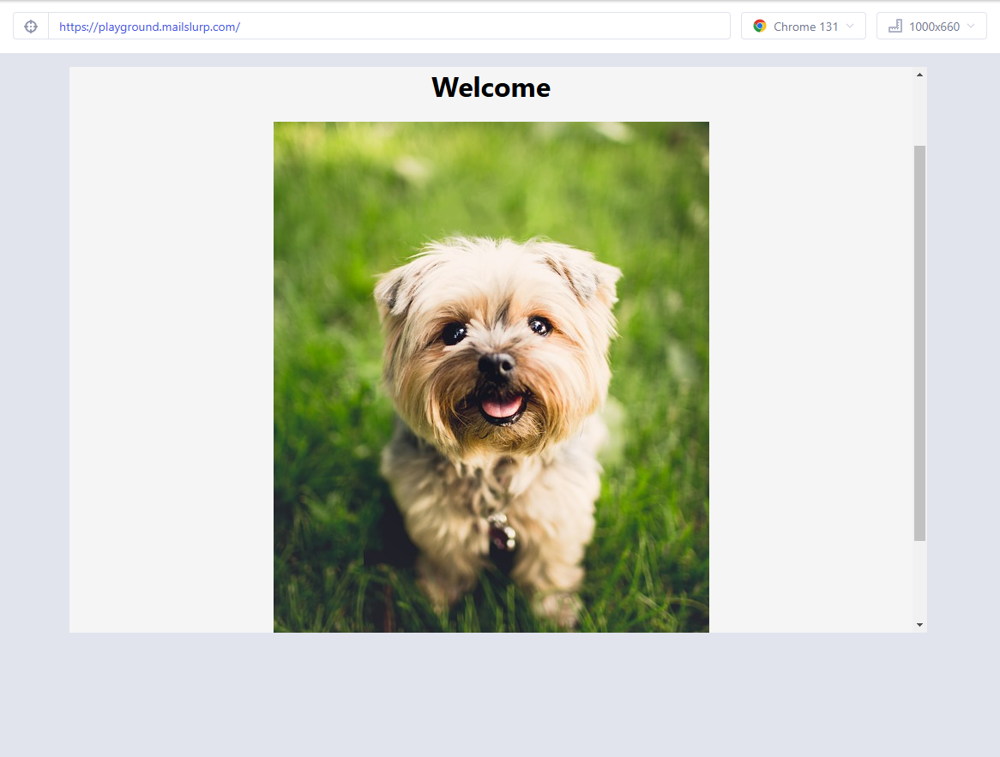

# Cypress MailSlurp Integration for Two-Factor Authentication Testing

This project demonstrates how to test a user sign-up and login flow with two-factor authentication (2FA) using [Cypress](https://www.cypress.io/) and [MailSlurp](https://www.mailslurp.com/). MailSlurp provides disposable email addresses for end-to-end testing of email-based workflows.

## Features
- Automated testing of user sign-up flow.
- Verification of two-factor authentication codes via email.
- Login functionality testing after successful sign-up.

## Tech Stack
- **Cypress**: End-to-end testing framework.
- **MailSlurp**: Email testing and disposable inbox management.
- **JavaScript**: Programming language for writing test scripts.

## Prerequisites
1. Node.js installed on your system.
2. Cypress installed globally or in your project.
3. A MailSlurp API key.

## Installation

1. Clone the repository:
   ```bash
   git clone https://github.com/your-username/your-repository.git
   cd your-repository

## Setup Instructions

### 1. Install Dependencies

Run the following command to install the necessary dependencies:

    ```bash
    npm install
    ```

### 2. Add Your MailSlurp API Key

1. Create a `cypress.env.json` file in the root directory of the project.
2. Add the following content, replacing `your-mailslurp-api-key` with your actual MailSlurp API key:

```json
{
  "MAILSLURP_API_KEY": "your-mailslurp-api-key"
}
```
Usage
-----

1. Start the Cypress Test Runner:
    ``` bash
    npx cypress open

2. Select the test file (e.g., `spec.cy.js`) and run the tests.

## Test Workflow

### User Sign-Up and Email Verification

1. Visit the test playground at [https://playground.mailslurp.com](https://playground.mailslurp.com).
2. Create a disposable inbox using MailSlurp.
3. Enter the generated email address into the sign-up form.
4. Retrieve the verification code sent to the inbox.
5. Complete the 2FA verification process.
6. Log in with the newly created credentials.

### Expected Results

- Users should successfully sign up with the 2FA code received via email.
- Users should see a "Welcome" message after logging in.

## Key Test Highlights

- **Email Retrieval with MailSlurp:**  
  The project uses MailSlurp’s `createInbox` and `waitForLatestEmail` methods to fetch emails during testing.

- **Dynamic Email Handling:**  
  Disposable email addresses are generated dynamically during each test.

- **Cypress Timeout Management:**  
  Custom timeouts are implemented to handle asynchronous operations like email retrieval.

## Test Results

Below are the screenshots of the test results after running the project:

### 1. Visit the Website


### 2. Seek for Create Account and then Clicks it


### 3. Gets Email and Enters Email Address


### 4. Gets Password and Enters Password


### 5. Clicks on Create Account


### 6. Gets Verification Code


### 7. Enters Code then Confirms


### 8. Signs In with Account


### 9. Navigates to HomePage


## Troubleshooting

### Common Issues

- **Timeout Errors:**
  - Increase the timeout for email retrieval or element selection.
- **Element Not Found:**
  - Ensure the selectors used in the test match the target elements in the application.

### Debugging

- Use `cy.log()` to debug intermediate steps.
- Check the Cypress Test Runner for detailed error stack traces.

## Acknowledgments

- [Cypress](https://www.cypress.io/) for an excellent testing framework.
- [MailSlurp](https://www.mailslurp.com/) for disposable email solutions.
